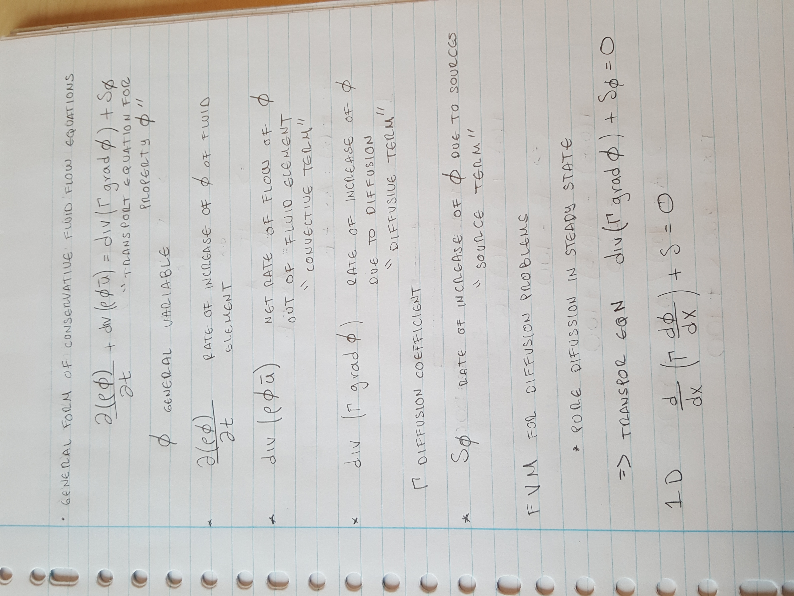
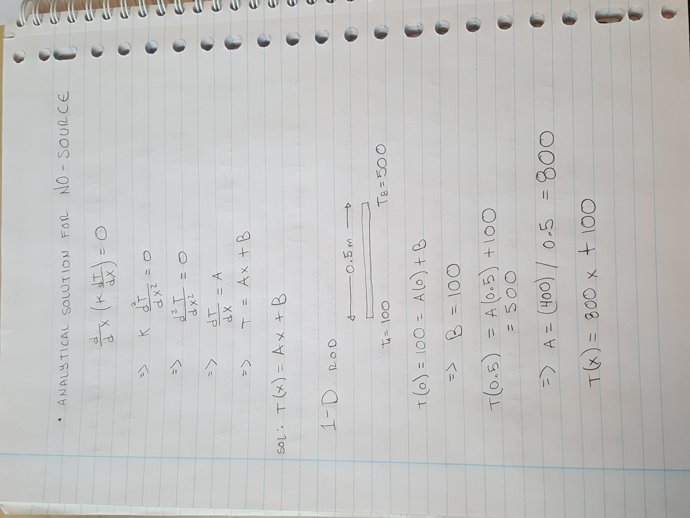
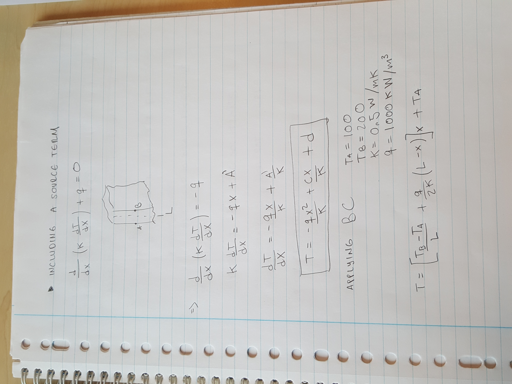
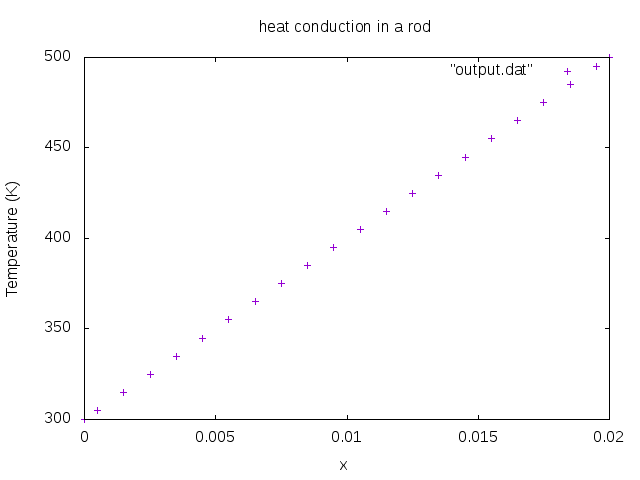

## First practicum:
  
### Finite Volume Method for heat transfer
General form of conservation equations

1. heat conduction in a 1-D rod

2. heat conduction in the rod with a source term

#### No source term numerical solution and analytical solution

Format: 

#### Source term numerical solution

Format: 

